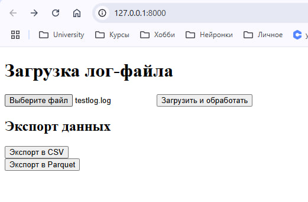
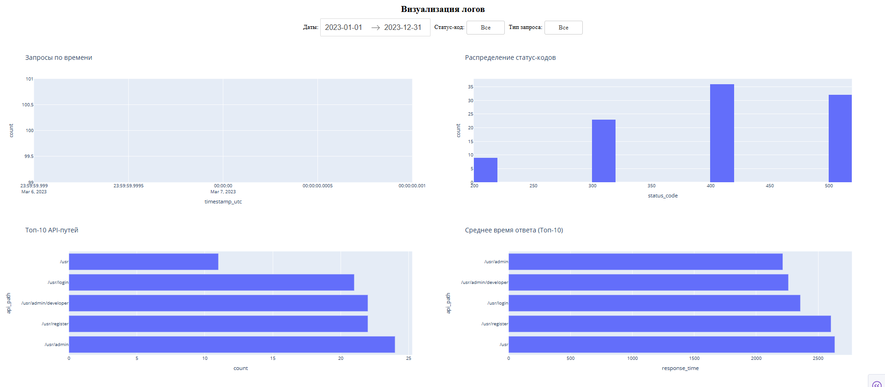
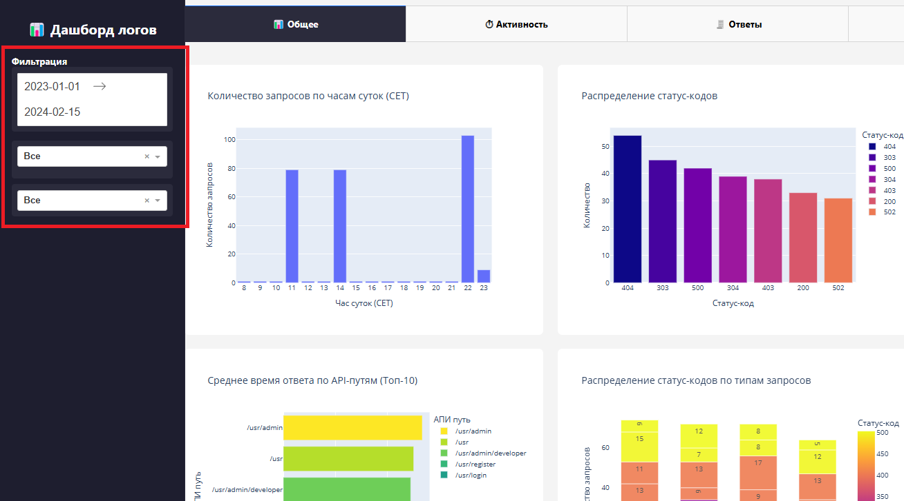

# Хакатон ЦК

👇👇👇
[Видео-демонстрация работы сервиса](https://disk.yandex.ru/i/DP44nTcDqhRMsg)

## `log2db`

Модуль позволяет загружать логи в базу данных, и выгружать их из неё.

За локальную загрузку отвечает `main.py`.

За веб-приложение и загрузку по API отвечает `run_api.py`.

Веб-страница запускается с помощью `run_api` в корневой директории:

```bash
python -m log2db.run_api
```

Мы можем вручную протестить API после запуска:

```bash
 curl -F "file=@log2db/local_logs/testlog.log" http://127.0.0.1:8000/upload/
```

> ❗️ Пока не реализовали удаление файла логов после запуска. Нужно допилить при выкате в прод

## `html_page`

Модуль отвечает за веб-интерфейс загрузки логов в БД, и экспорт логов из базы в `csv` и `parquet`, а также позволяет перейти на страницу дашборда



После запуска `run_api.py` переходи на страницу **`http://127.0.0.1:8000/`**, выбери файл и обработай его, или экспортируй логи из базы

## Дашборд

Дашборд строим на `dash`, за него отвечает модуль `rendering.dashboard`. Чтобы обновить графики, меняй функции в модуле.

Макет дашборда находится в `rendering.layout`. Чтобы изменить расположение элементов, меняй разметку в модуле.

Графики для удобства изучения разделены по тематическим вкладкам:
- "Общее" - единомоментно показаны все графики
- "Активность" - статистика по активности пользователей
- "Ответы" - различная статистика по количеству и распределению запросов и статус-кодов по ним
- "API" - статистика частоты запросов и времени их обработки в зависимости от API пути
- "Производительность" - статистика по запросам, коррелирующая с нагрузкой на сервис



Также в дашборде представлены:
- Селектор даты для просмотра логово в конкретный период
- Селектор типов запросов
- Селектор статус-кодов




## ⚙️ Подключение к базе

Создай в корневой директории файл `.env` и пропиши своё подключение к базе:

```env
DB_HOST=''
DB_PORT=''
DB_NAME=''
DB_USER=''
DB_PASS=''
```

Скрипт будет записывать и читать логи из базы
