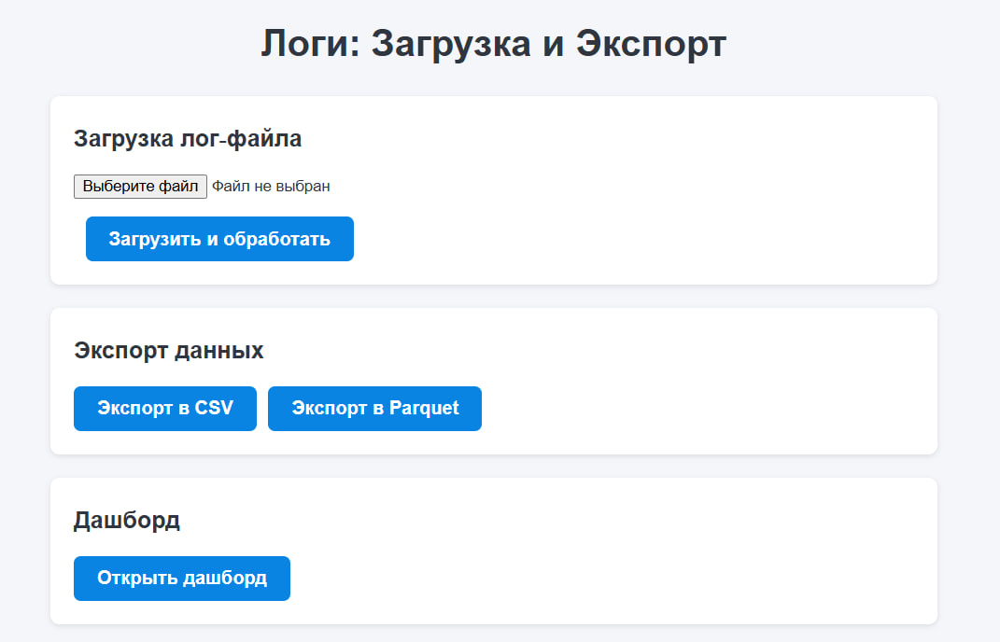

# Хакатон ЦК

## `log2db`

Модуль позволяет загружать логи в базу данных, и выгружать их из неё.

За локальную загрузку отвечает `main.py`.

За веб-приложение и загрузку по API отвечает `run_api.py`.

Веб-страница запускается с помощью `run_api` в корневой директории:

```bash
python -m log2db.run_api
```

Мы можем вручную протестить API после запуска:

```bash
 curl -F "file=@log2db/local_logs/testlog.log" http://127.0.0.1:8000/upload/
```

> ❗️ Пока не реализовали удаление файла логов после запуска. Нужно допилить при выкате в прод

## `html_page`

Модуль отвечает за веб-интерфейс загрузки логов в БД, и экспорт логов из базы в `csv` и `parquet`



После запуска `run_api.py` переходи на страницу **`http://127.0.0.1:8000/`**, выбери файл и обработай его, или экспортируй логи из базы

## ⚙️ Подключение к базе

Создай в корневой директории файл `.env` и пропиши своё подключение к базе:

```env
DB_HOST=''
DB_PORT=''
DB_NAME=''
DB_USER=''
DB_PASS=''
```

Скрипт будет записывать и читать логи из базы
